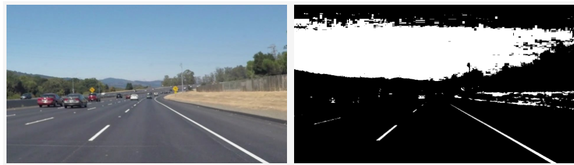
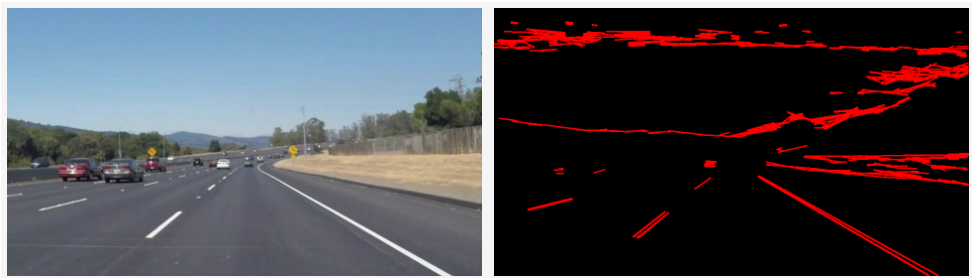
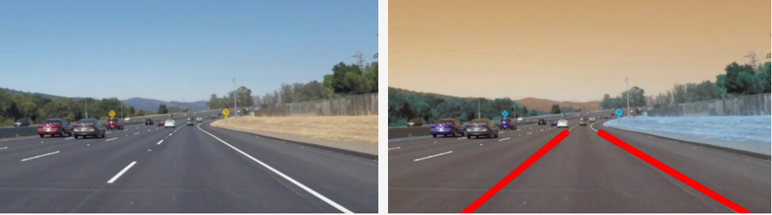
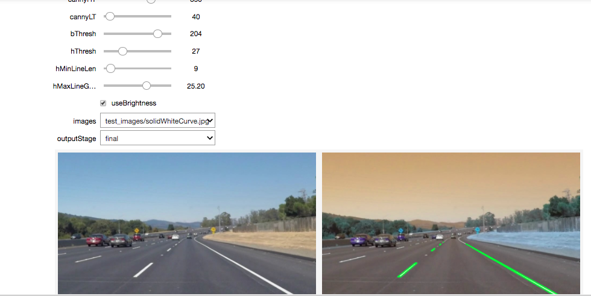

# **Finding Lane Lines on the Road** 

## Reflection

### 1. Describe your pipeline. As part of the description, explain how you modified the draw_lines() function.

1. **HSV color space conversion and noise removal:** First step in the pipeline was to remove as much unwanted information as possible. For this, I converted the images to **HSV** format and picked up the *Variance* values for those pixels whose *Variance* or *Brightness* was more than approximately *200*. This reduced the image to mostly bright yellow and white colors, which usually belong to the lanes.

2. **Hough Lines and Canny Edges:** In order to find **hough lines**, next step was to find the **canny edges** on the above reduced image after applying the **gaussian blur** filter.

3. **Best Line Selection:** The bunch of hough lines calculated in the previous step contained atleast one line corresponding to each lane. To find the line which best represented a lane:
	
	*3.a)* Firstly, I filterd all the lines based on the following criteria:
	1. The magnitude of the **slope** should be between approximate *30 degrees* to *60 degrees* (Experimentally determined values)
	2. The **length** of the line segment should be greator than *20 pixels*

	*3.b)* Secondly, I categorized all lines having **negative** slope to the left lane and **positive** slope to the right.
	
	*3.c)* Thirdly, for each lane side, I picked up one best estimate line by sorting all the candidate lines based on their **distance from the base line** of the image ( lines closer to the base preferred ) and based on the **length of the line segment** ( larger line length preferred ).
4. **Extrapolation:** On finding the approximate line segment for each lane, next step was to extrapolate both the lines starting from the image base up to maximum height possible. The maximum height was calulated as **max** **(*height of left lane*, *height of right lane*, *image height / 1.5* )**. Extrapolation was performed by finding the equation of the line in a 2d plane (see *Line.py*) and then calculating two end points of the full extrapolated line using this equation.

5. **Temporal Smoothing**: Between adjcent frames of the video, we need to ensure that lines don't deviate significantly from previous estimates, that can happen due to some error. Assuming that the lane lines don't change significanly in a short span of time, I averaged the slope and bias of each lane line with slope and bias values of the previous frame. Lines were drawn using these averaged values instead of using the exact calculated values.

6. **Parameters Tuning**: For determining the best set of parameters possible, I developed a small Jupyter Notebook (***Interactive_Params_Tuning.ipynb***) and leveraged Jupyter Notebook's UI Interaction widgets to develop an interface where I could perform quick trial and error experiments of altering all the hyper parameters involved in the pipeline and immediately see the changes in all of the test images. I played around with the paramters until I saw best results in all of the test images.

---
### 2. Identify potential shortcomings with your current pipeline

1. **Bright objects near lanes**: Any bright white/yellow car or a road spot could be incorrectly filtered as possible lane line pixel area and can cause deviations in the detected line from the actual lane.

2. **Extrapolation ignores curved roads**: Since extrapolation assumes that lanes are straight lines, any curves in the lanes won't be detected and will be deviated from the extrapolation of the line segments.
3. **Parameters tuned to specific examples**: The set of parameters have been tuned such that the pipeline gives best results only for the example videos provided in the project. This can potentially degrade performance when the pipline is subjected to videos with different lighting, road or lane conditions.

---

### 3. Suggest possible improvements to your pipeline

1. **Parameter Learning**: We can improve the parameter tuning process by manually annotating some test images with lane lines and then optimizing an error function which is based on the deviation of detected lanes from manually annotated lanes of those test images. Since the error function might not be differentiable, we can perform a grid search on a set of limited parameters and select the one which gives the least error.

2. **Temporal Correcting**: We can keep track of the line segments detected as lanes. Assuming that the lines don't change significantly in a short period of time, we can spot any calculated lines that deviate highly from earlier detected lines and correct the lines by averaging or completely ignoring the detected outlier lines.

3. **Contour Verification**: To increase the confidence of the detected lines, we can find contours in some extended region of the detected lines and verify that the pixels within the contours contain uniform white or yellow lane colors and also approximate to quadrilateral shape.

