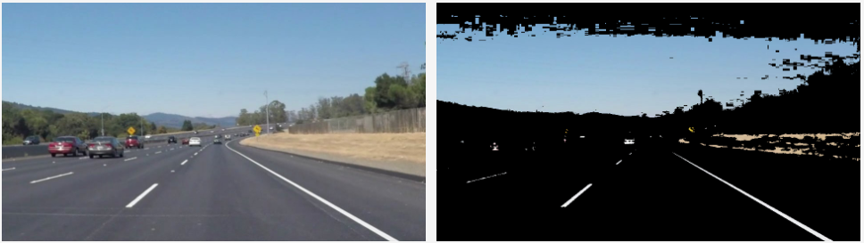

# **Finding Lane Lines on the Road** 

---

## Reflection

### 1. Describe your pipeline. As part of the description, explain how you modified the draw_lines() function.

####Finding approximate 2-d lines equation corresponding to both the lanes:

1. Instead of using gray image, I converted the images to **HSV** format and picked up the *Variance* values for those pixels whose *Variance*/*Brightness* was more than approximately *200*. This reduced the image to mostly bright yellow and white colors, which usually belong to the lanes. This step reduced noisy pixels from the image.

2. In order to find **hough lines**, next step was to find the **canny edges** on the above reduced image after applying the **gaussian blur** filter.

3. The bunch of hough lines calculated in the previous step contained atleast one line corresponding to each lane. To find the line which best represented a lane:
	
	3.a) Firstly, I filterd all the lines based on the following criteria:
	1. The magnitude of the **slope** should be between approximate *30 degrees* to *60 degrees* (Experimentally determined values)
	2. The **length** of the line segment should be greator than *20 pixels*

	3.b) Secondly, I categorized all lines having **negative** slope to the left lane and **positive** slope to the right.
	
	3.c) Thirdly, for each lane side, I picked up one best estimate line by sorting all the candidate lines based on their **distance from the base line** of the image ( lines closer to the base preferred ) and based on the **length of the line segment** ( larger line length preferred ).
4. On finding the approximate line segment for each lane, next step was to extrapolate both the lines starting from the image base up to maximum height possible. The maximum height was calulated as **max** **(*height of left lane*, *height of right lane*, *total height / 1.5* )**.

### 2. Identify potential shortcomings with your current pipeline

Following are the shortcoming with this approach:

1. **Bright objects near lanes**: Any bright white/yellow car or a road spot could be incorrectly filtered as possible lane line pixel area and can deviate the detected line from the actual lane.
2. **Extrapolation ignores curved roads**: Since extrapolation assumes that lanes are straight lines, any curves in the lanes won't be detected and will be deviated from the extrapolation of the line segments.

### 3. Suggest possible improvements to your pipeline

Following are some suggested improvements to this pipeline:

1. **Temporal Correcting**: We can keep track of the line segments detected as lanes. Assuming that the lines don't change significantly in a short period of time, we can spot any calculated lines that deviate highly from earlier detected lines and correct the lines by averaging or completely ignoring the detected outlier lines.
